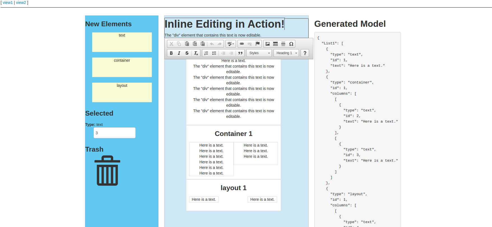

# Angular+CKEditor+Drag and Drop



## About
This project was generated with [angular-cli](https://github.com/angular/angular-cli) version 1.0.0-beta.26.
Using Angular+CKEditor+Drag and Drop, Edit the Basic Template.
This Angular+CKEditor+Drag and Drop example is written by [Big Silver].

## Quick Start

```bash
# clone our repo
$ git clone https://github.com/Big-Silver/Angular-Drag-and-Drop.git angular-Drag-and-Drop

# change directory to your app
$ cd angular-Drag-and-Drop

# install the dependencies with npm
$ npm install

# start the server
$ npm start
```

## Development server
Run `ng serve` for a dev server. Navigate to `http://localhost:4000/`. The app will automatically reload if you change any of the source files.

## Code scaffolding

Run `ng generate component component-name` to generate a new component. You can also use `ng generate directive/pipe/service/class/module`.

## Build

Run `ng build` to build the project. The build artifacts will be stored in the `dist/` directory. Use the `-prod` flag for a production build.

## Running unit tests

Run `ng test` to execute the unit tests via [Karma](https://karma-runner.github.io).

## Running end-to-end tests

Run `ng e2e` to execute the end-to-end tests via [Protractor](http://www.protractortest.org/).
Before running the tests make sure you are serving the app via `ng serve`.

## Deploying to GitHub Pages

Run `ng github-pages:deploy` to deploy to GitHub Pages.

## Further help

To get more help on the `angular-cli` use `ng help` or go check out the [Angular-CLI README](https://github.com/angular/angular-cli/blob/master/README.md).
